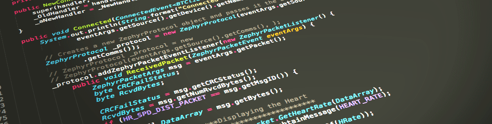

# Mehmet YILDIRIM

Hi! I am Mehmet, a software engineer with sixteen years of work experiences on design and development web based software applications and services. I have 2 years of experience on managing a software development unit. Have excellent interpersonal skills to effectively communicate with technical teams and staff at all levels of the organization including both technical and non-technical people.

<h3 align="left">Languages and Tools:</h3>

              

          
            

